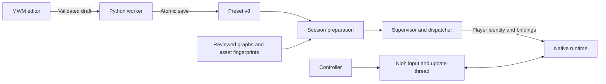
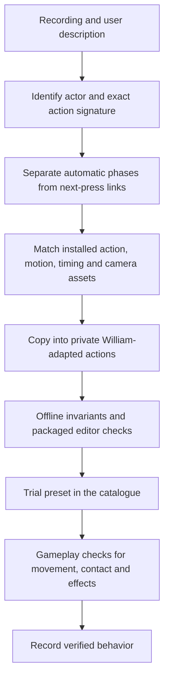
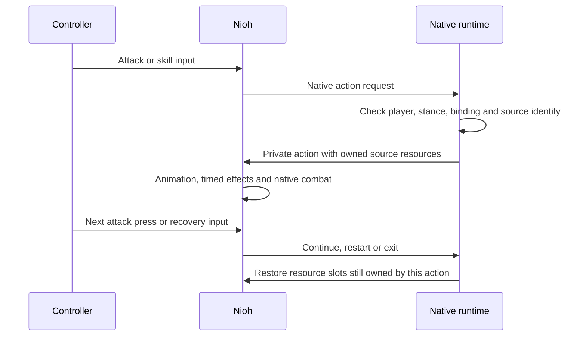

# Tanto Engine

Tanto adapts Nioh 1 boss moves for William. **MWM** is its portable moveset editor; the current gameplay backend supports **single katana**. Recorder is a separate, read-only application for collecting action and resource evidence.

[Download the latest MWM EXE](https://github.com/neuriv/tanto-engine/releases/latest) · [Playing and controls](mwm/README.md) · [Code guide](CODE_GUIDE.md) · [Release contract](RELEASES.md)

## Start playing

1. Download `MWM.exe`. It contains the editor, Python worker, native runtime and move definitions; players do not need Python or Node.
2. Enter a Nioh mission with a single katana. Open MWM, choose a preset or assign individual moves, then **Save changes** and **Enable mod**.
3. Disable the mod before editing the active setup. Closing the editor leaves an enabled mod running. After updating native code, restart Nioh before enabling the new version.

Your settings and recordings live outside the EXE. Updates preserve them. Steam Input supplies XInput for supported PlayStation controllers; see the [controller guide](mwm/README.md#controllers).

## Moves and inputs

Strings replace ordinary Quick or Strong attacks. Each additional press advances the string; further presses restart it after its final strike. Skills use their assigned native input or an explicit custom chord. R1/RB remains Ki Pulse and stance control.

The **Maria sword** preset assigns:

| Input | Move |
| --- | --- |
| Mid Square / X | Three-phase quick string |
| High Triangle / Y | Horizontal string with jumping ender |
| Low Square / X | Two-phase aerial kick string |
| Mid L1 + Triangle / LB + Y | Forward slash |
| High Strong, then L1 + Square / LB + X | Jin's downward slash |

The alternate Maria preset replaces Mid Quick with her dodge-slash string. Hit counts and input counts differ: one animation can contain multiple hits. Grabs, evasions, buff, teleport and beam recordings remain outside this playable batch.

**Ishida sword** adds five recorded strings: double slash, three-hit, spinning ender, spinning opener, and five-hit. The preset assigns them across Low/Mid/High Quick and Strong inputs. Repeated and shared phases retain their own routes. His grapple and two beam recordings remain unsupported; the five adapted strings await gameplay verification.

**Cast cancellation:** use Onmyo or a shuriken while the preceding sword attack still has a native Pulse opportunity, then press R1/RB inside that move's fixed window after the effect releases. Eligible moves target 60% Onmyo and 70% shuriken coverage, with overlap and rounding to whole source phases. William's 20 native Quick/Strong stages are included. Windows stay the same across attempts, bindings and presets; early R1 presses are discarded. The adapter never extends the native Pulse deadline or writes Ki/item counts.

## Architecture

The editor saves configuration. The worker prepares resources and publishes intent. Only the native runtime selects gameplay actions, on Nioh's own update thread.



| Area | Responsibility |
| --- | --- |
| `mwm/desktop/` | Electron editor, controller capture and guide |
| `mwm/app/web_worker.py` | Request protocol, complete-draft validation and saved presets |
| `runtime/engine_config.py`, `prepare_session.py` | Compile bindings, match the game/player and resolve required resources |
| `runtime/supervisor.py`, `run_dispatch.py` | Process ownership, attachment, controller intent and trace collection |
| `runtime/native/` | Game-thread hooks, private action graphs, timing and owned-resource restoration |
| `mwm/data/`, `mwm/dataset/` | Playable definitions, presets and preserved recording evidence |

### From recording to playable move

An action ID is local to a source bank. It cannot identify a move on its own. Importing requires the recorded actor, action, payload, motion, timing and game build to agree.



Native asset indices are preserved while only required motion clips are decoded. Source boss data stays unchanged. Projectiles, weapons and cameras need their own dependencies; loading an animation does not prove a working hitbox or projectile.

### Execution and cleanup



Death, changed actors, menus and controller gaps invalidate pending input. Disable stops new work and lets owned state recover. Hooks and allocations may remain retained until Nioh exits; a different native build is rejected in the same game process.

## Develop and verify

Use PowerShell 7, Python with `requirements-build.txt`, an x64 C++17 MinGW toolchain (`gcc`, `g++`), and Node/npm for the editor. Keep the Recorder checkout beside this repository for its shared integration checks.

```powershell
# From the repository root
python -m pip install -r .\requirements-build.txt
npm --prefix .\mwm ci
.\runtime\native\Build.ps1
.\Test-Offline.ps1 -PythonRuntime python
.\mwm\Trainer.ps1 -PythonRuntime python
```

Tests cover real native code against owned memory, malformed and exhausted resource decoding, configuration and process lifecycle, and the actual Electron editor/worker. Release builds also run a copied EXE in an isolated directory and record source, dependency and artifact hashes.

Offline tests can establish input routing, field widths, graph transitions, resource boundaries and UI transactions. Physical controller behavior, damage, movement, effect persistence and encounter transitions still need gameplay evidence. The earlier uniform Guardian Spirit Talisman/shuriken cancels were verified in game. The new variable windows and Ishida strings require gameplay checks. Open crash reports #2 and #27 remain unresolved; offline checks do not reproduce their causes.

See [the native walkthrough](runtime/native/NATIVE-WALKTHROUGH.md) for memory contracts and [RELEASES.md](RELEASES.md) for immutable versioned builds. Source captures, development tools and private recordings are excluded from the EXE.
