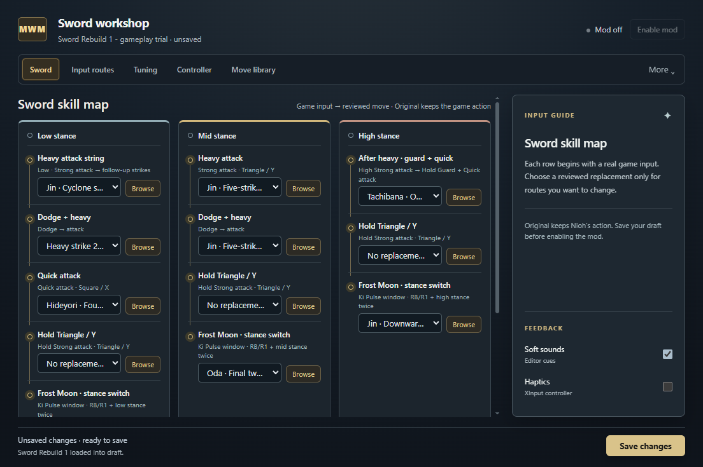
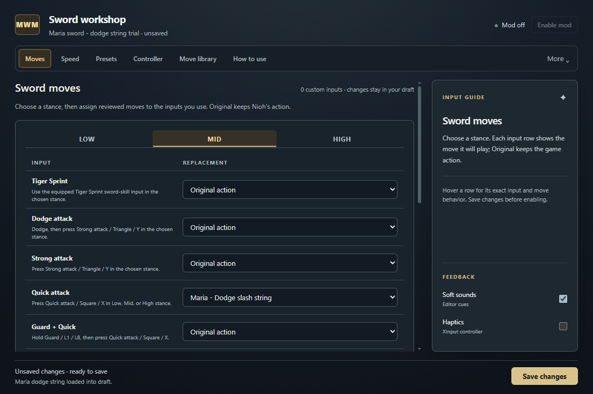
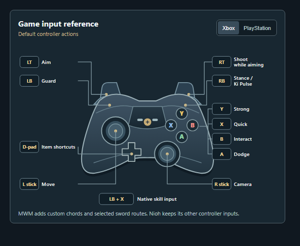
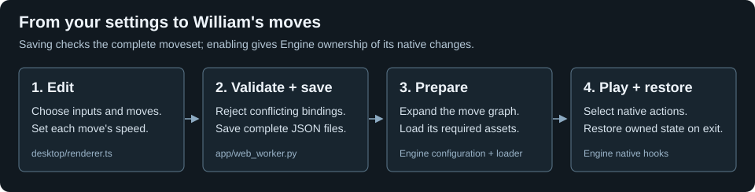
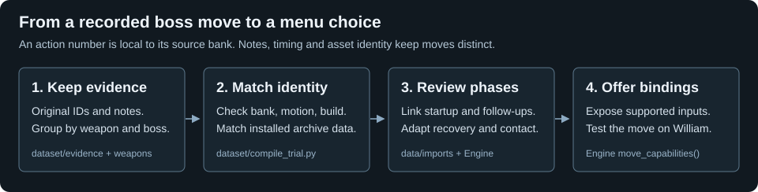

# MWM — Multi-Weapon Moveset Mod

A portable Nioh moveset editor, starting with single katana. Choose the moves assigned to your inputs, adjust their speed, and save reusable bindings. Ten weapon movesets are planned; the current runtime supports sword.

The **How to use** tab walks through the four-step edit, route, controller, and save workflow.

## Start playing

Download **MWM.exe** from [Latest release](https://github.com/neuriv/tanto-engine/releases/latest). The EXE contains its own interface, Engine worker and move definitions; no Python, Node or extra asset downloads are needed. Nioh itself must be installed.

Open Nioh, enter a mission with a single katana, then open MWM. New installs start with **Sword Rebuild 1**; existing saved settings stay intact. Choose your assignments and **Save changes**, then **Enable mod**. Disable the mod before saving edits; invalid drafts stay in the editor and never change the running moveset. Use **Disable mod** to return to normal gameplay; closing the editor leaves an enabled mod running. After an Engine update, restart Nioh before enabling the new EXE. Stop retains native code until the game exits; mixing builds is blocked.

## Default controls

PlayStation and Xbox labels describe the same logical buttons. Frost Moon requires a Ki Pulse window: hold R1/RB and tap the destination stance button twice.

| Input | Move |
| --- | --- |
| Low heavy / dodge-heavy | Jin's three-hit string / second cyclone slash |
| Mid heavy / dodge-heavy | Jin's five-hit string |
| Low quick | Hideyori's four-hit string |
| High heavy, then L1/LB + Square/X | Tachibana's instant Omnislice |
| **Low stance: tap L1/LB + L2/LT** | bloodborne gun shot, 1.15× speed; sword hidden during firing |
| Frost Moon → Low / Mid / High | Flying Swallow / Oda's two slashes at 1.1× / Jin's downward slash |

bloodborne gun shot uses tap-and-release; holding is unassigned by default. A new shot waits for the previous action to finish. [Configuration details](configurations/README.md) separate tested playback from remaining contact and recovery checks.

## Change your bindings

**Moves** shows Low, Mid and High tabs with each native input and its replacement. Use the route controls for custom tap, hold or follow-up chords. Strings belong on Quick/Strong attacks; skills belong on skill inputs. Select **Launcher only** or **Launcher + Izuna Drop** on supported held, custom or original inputs. The drop still needs native enemy contact.

Custom routes accept two distinct buttons from L1/LB, Circle/B, Triangle/Y, L2/LT and Square/X, with an optional third-button follow-up. Up to 24 custom rows coexist with 32 native binding slots. **Controller** retains the broader global chord and its shared hold threshold; R1/RB remains reserved for Pulse and Frost Moon. Press to bind, release the controls, then press the intended button. Mapping changes stay in the draft until Save. Imported graphs require an explicit stance, and conflicting routes are rejected with a correction.

**Speed** controls bounded playback rates. Clearing a phase restores inheritance; entering `1` requests native speed. **Presets** saves complete movesets and reusable binding groups. **Move library** searches move names, descriptions and IDs; Browse respects the destination's supported choices. **How to use** explains controls and cast cancellation. The side guide follows hovered or focused controls; sounds can be muted and binding haptics are optional. **More** includes Frost Moon and the sword baseline. Ki Pulse authoring, physics and Frost timing remain developer-controlled.

## Maria presets and cast cancellation

Load **Maria sword** or **Maria dodge string** in the editor, then review and save the draft.

| Input | Maria sword |
| --- | --- |
| Mid Quick / Square / X | Quick string, three phases |
| High Strong / Triangle / Y | Horizontal string, two phases |
| Low Quick / Square / X | Aerial kicks, two phases |
| Mid Guard + Strong | Forward slash |
| High Strong → Guard + Quick | Jin downward slash, retained for cast testing |

The dodge preset swaps Mid Quick for the dodge-slash string. Continue pressing the assigned attack to advance and restart a completed string; stopping input retains normal recovery. A phase may contain several hits. Seven recorded Maria candidates remain unsupported, including grabs, evasions, buff, teleport and beam attacks.

For Onmyo or shuriken cancellation, start a sword attack with a remaining Ki Pulse window, use the shortcut, then tap **R1/RB after the effect releases**. The engine requests a native Pulse and lets the effect persist. Cast families use their native release events and share the preceding attack's Pulse window. Casting from idle does not manufacture one.

The user confirmed Guardian Spirit Talisman and shuriken cancellation and the initial Maria animations. Later High continuation and string-restart fixes pass the native offline matrix but await a fresh gameplay check; other Onmyo items and damage/contact coverage remain unverified.

## Controllers

Xbox uses XInput. For PS5, enable Steam Input for Nioh so it appears as XInput; the saved PS4 mapping remains available. Press to bind detects a supported controller even when Nioh is closed or its frames are paused. Disable the mod before saving a new mapping, then enable it again. With multiple pads connected, the recorded XInput slot becomes the pending game slot; choose another slot explicitly if needed. Raw, uncalibrated DualSense input is unsupported. Left-stick movement is separate from button binding and Frost Moon edge detection.

Automated checks cover logical Xbox/PS mappings, analog triggers, slot changes, held inputs and native action dispatch. Physical Xbox/PS5 and another-PC acceptance remain pending; raw, uncalibrated DualSense input is not assumed to work.

## How the code works

`desktop/` owns the Electron/TypeScript/CSS editor. `app/web_worker.py` validates complete drafts through Engine, saves settings atomically and reports lifecycle state. Engine expands selected graphs, loads their assets, and selects private player-adapted actions on the game thread. The publisher sends the custom chord's logical buttons and stance, letting native input handling reserve matching attack inputs. Borrowed resources and temporary sword visibility are restored on exit; the renderer never writes game memory.

`dataset/` organizes 67 annotated sword candidates and one handgun record by weapon and boss, preserving notes and hashed evidence. `data/imports/` describes reviewed phase graphs; `data/resources/` identifies installed assets; `data/presets/` holds assignments. `dataset/compile_trial.py` reproduces archive matches. Raw recording archives stay in this private repository and are excluded from the EXE.

bloodborne gun shot demonstrated why animation alone is insufficient: C6A created object IDs `229757` and `944393` at frames 13 and 78, but their models were absent. Its profile now requests native asset keys `3257` and `3258` before activation. The user confirmed firing, the faster timing and sword hiding. Hideyori's zero boss Ki cost required William's native Low-quick costs; live Ki recovery is observed, but manual Pulse acceptance remains pending.

## Evidence and remaining checks

The user confirmed Jin's six routes, Oda's two slashes, Omnislice playback and bloodborne gun shot. Isolated Jin Low-heavy testing also confirmed normal movement and death/retry. These results do not establish every enemy contact, projectile damage, camera or mission transition. An alpha.3 activation exited during resource loading while older source-build modules were retained. The exact crash cause is unconfirmed; preparation now rejects mixed native builds before loading resources, and a resource-loading exit stops activation until another explicit Enable. The initial multi-boss failure exposed a loader hook left attached during pending I/O; Engine now detaches after submission and stops activation on load failure.

Boss action IDs are bank-local keys, not universal move names or boss identifiers. Jin and Oda both use `0x00000C6E`/`0x00000C6F` for different motions. Preserve the full 32-bit key, boss/source bank, payload bytes, motion/timing keys and game build together. One execution can contain several hits, and consecutive IDs do not prove a combo. Actor addresses can change or be reused after a death; generation and action-counter continuity matter more than the address alone.

Hideyori's `0x00000D30 → D31 → D32 → D33` has consecutive observed counters 219–222 and native transition links: enough evidence for a four-phase trial, without inventing a fifth hit. Tachibana's `D8C → D8D` matches the proposed preparation/Omnislice order; the step-back/sheath interpretation is still a hypothesis. Oda's `C6E → C6F` has a native frame-40 continuation. Sanada's `C6A` was observed twice at counters 402/403; `C6B` is only an available native branch. Counter 404 was missed, and a later previous-action pointer suggests `BB8`; neither fact proves another gunshot or its execution time.

The new source action packages match recorded payload prefixes in `archive_00.lnk` entries 147 (Hideyori), 103 (Oda), 107 (Tachibana) and 134 (Sanada). Companion timing/motion/camera triples in `archive_01.lnk` are 4048–4050, 3996–3998, 4005–4007 and 4038–4040 respectively. Their reviewed key sets and adjacency support the trial mapping; matching asset bytes does not prove correct behavior on William. `dataset/compile_trial.py` reproduces these fingerprints without storing extracted game assets.

Match descriptions against the final few relevant executions before Stop, looking past idle/recovery and across all captured actor candidates. A written pause or death is timing context, not proof of an observed memory event. Raw captures stay in their recording library; local development outputs stay inside the repos. Earlier exported previews are retained under ignored `local-artifacts/previous-exports/`.

## Build and release

MWM lives in this repository's `mwm/` folder. Keep Recorder beside the repository for integration tests. After `npm ci` in `mwm/`, `Trainer.ps1` builds current native libraries and opens the source UI. The repository root's `Test-Offline.ps1` runs both maintained suites, including product UI and binding checks.

Close the source editor before building. `Build.ps1` requires clean source, a new version and release notes. It packages and checks an isolated EXE, then records hashes and an immutable version tag. Packaged checks exercise startup, Maria presets, actual UI rebinding, saved settings, controller translation and bundled assets with game access blocked. [The architecture diagrams](../README.md#architecture) and [code guide](../CODE_GUIDE.md) explain the module boundaries.
